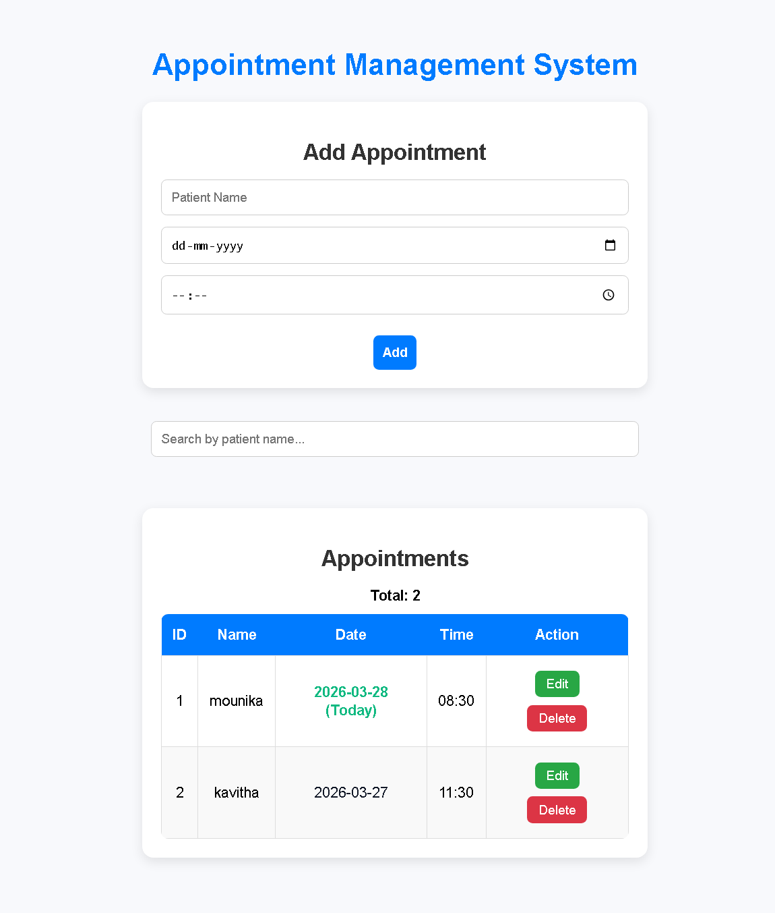

# 🗓️ Appointment Management System

A modern and responsive **React-based web application** to manage appointments efficiently. Users can add, edit, delete, and search appointments with ease. The application ensures **data persistence using localStorage**, so data remains even after refreshing the page.

---

## 🚀 Live Demo  
👉 https://appointmentmanagementaapp.netlify.app/

---

## 📸 Screenshots

### 🔹 Main Dashboard


> Displays appointment form, search bar, and appointment list with edit/delete options.

---

## ✨ Features

- ➕ Add new appointments  
- ✏️ Edit existing appointments  
- ❌ Delete appointments  
- 🔍 Search appointments by patient name  
- 💾 Persistent data using **localStorage**  
- 📱 Fully responsive design  

---

## 🛠️ Tech Stack

- **Frontend:** React, JavaScript  
- **State Management:** React Hooks (useState, useEffect)  
- **Storage:** Browser localStorage  
- **Styling:** CSS  
- **Deployment:** Netlify  

---

## 🧠 Key Highlights

- Implemented full **CRUD operations**  
- Built **dynamic UI with real-time updates**  
- Added **search functionality for quick filtering**  
- Used **localStorage for persistent storage without backend**  
- Designed a **clean and user-friendly interface**

---
Installation & Setup

```bash
# Clone the repository
git clone https://github.com/mounikamalineni26/appointment-management.git

# Navigate into the project
cd appointment-management

# Install dependencies
npm install

# Start the development server
npm start
